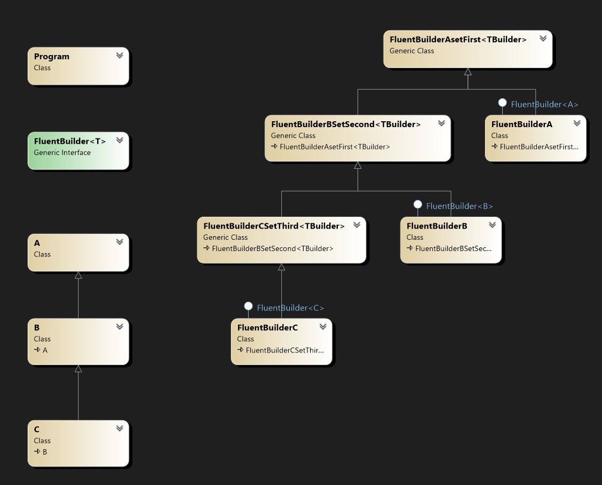

# FluentBuilderWithExtendedTypes
Example of fluent builders with etended types. Possibility to extend fluent builders

Task is to extend fluent builders for type T, but to also support derived classes of the base class T.
In this example the T base data type class is the A class.

Quick overview of the classes in diagram bellow

